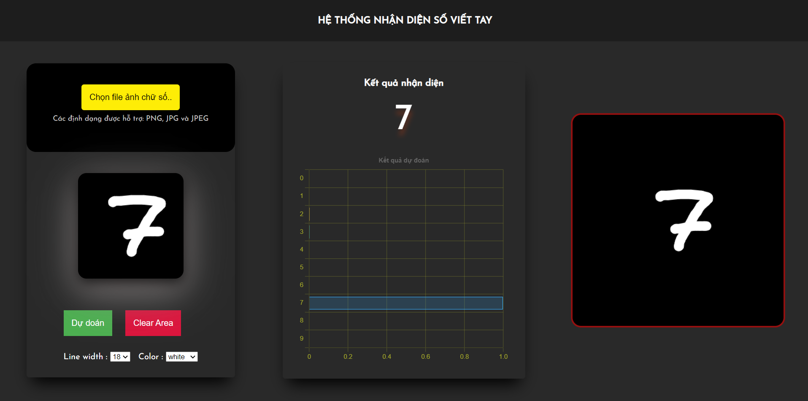

# mnist-dataset-demo

## Description

Image classification problem to help recognize handwritten digits
HTML, CSS, Python, TensorFlow JS

## Usage

1. Select picture or wirte in black canvas
2. Click button 'Dự Doán'

   

